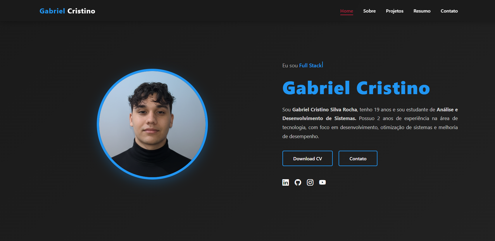

# Gabriel Portfolio Website 🌐

Bem-vindo ao meu **portfólio pessoal!**
Aqui você encontra minhas habilidades, projetos, artigos e formas de contato, tudo organizado em um layout moderno, responsivo e interativo.

---

## Live Demo 🚀

Veja o site funcionando diretamente neste link: [Live Demo](https://gabrieldevcristino.netlify.app)

---

## 🚀 O que este portfólio oferece

- **Seção Principal:** Conta com uma foto de perfil e um efeito de digitação apresentando minhas áreas de atuação (Desenvolvedor Web, Designer e Full Stack).

- **Layout Responsivo:** Adaptado para funcionar sem problemas em computadores, tablets e smartphones.

- **Sobre Mim:** Mostra um resumo da minha trajetória, habilidades com animações e minha foto de perfil.

- **Portfólio:** Exibe meus projetos com efeitos interativos quando o usuário passa o mouse.

- **Currículo:** Apresenta minha experiência profissional, cursos e formação em formato de linha do tempo.

- **Contato:** Formulário para envio de mensagens e ícones das minhas redes sociais.

- **Navegação Suave:** Permite rolar pelas seções de forma fluida, destacando o menu ativo.

- **Animações nas Seções:** Cada parte da página aparece com animação quando entra na área visível da tela.  

---

## 🛠 Ferramentas e Tecnologias

- **HTML5**  
- **CSS3** (Flexbox, Grid, Animations)  
- **JavaScript** (Typing effect, IntersectionObserver for animations, smooth scroll)  
- **Font Awesome** (Icons)  

---

## 📬 Contatos

- Email: gabriel.oficial.cristino@gmail.com
- Localização: Ceará, Fortaleza  
- LinkedIn: [LinkedIn](https://www.linkedin.com/in/gabrielcristino1)  
- GitHub: [GitHub](https://github.com/gban01)  
- Instagram: [Instagram](https://www.instagram.com/eugbazinoficial)

---

Desenvolvido com ❤️ por **Gabriel Cristino**
